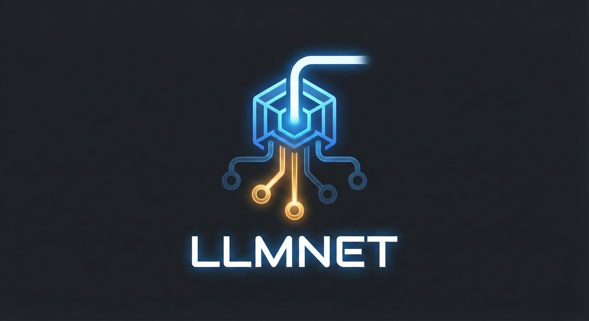
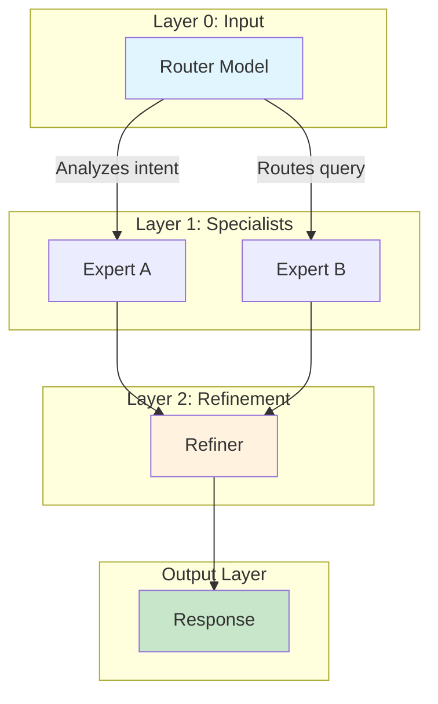

<div align="center">



<br>

**The future is small models routed to — intelligently.**

[](https://www.rust-lang.org/)
[](LICENSE)
[](https://github.com/Avarok-Cybersecurity/llmnet/actions)

*Orchestrate multiple LLMs into intelligent, layered pipelines with a single configuration file*

[Quick Start](#-quick-start) · [Examples](#-example-guides) · [Configuration](#%EF%B8%8F-configuration-reference) · [CLI](#-cli-reference)

</div>

---

## What is llmnet?

llmnet creates **layered AI pipelines** where requests flow through multiple models with intelligent routing at each stage. Think of it as a neural network, but each "neuron" is an LLM.

```
User Query → Router → [Expert A | Expert B | Expert C] → Refiner → Response
```

**Why llmnet?**
- **Cost optimization:** Route simple queries to cheap models, complex ones to powerful models
- **Specialization:** Use domain-specific fine-tuned models for different query types
- **Quality:** Add refinement layers to polish responses before delivery
- **Flexibility:** Swap models without changing code—just update the config

---

## Quick Start

### Installation

```bash
git clone https://github.com/Avarok-Cybersecurity/llmnet.git
cd llmnet
cargo build --release
```

### Run Your First Pipeline

```bash
# Validate configuration
./target/release/llmnet validate examples/basic-chatbot.json

# Start the server
./target/release/llmnet run examples/basic-chatbot.json
```

### Deploy to a Cluster

```bash
# Start the control plane (in one terminal)
./target/release/llmnet serve --control-plane

# Deploy a pipeline (in another terminal)
./target/release/llmnet deploy examples/basic-chatbot.json

# Check status
./target/release/llmnet get pipelines
```

### Make a Request

```bash
curl http://localhost:8080/v1/chat/completions \
  -H "Content-Type: application/json" \
  -d '{"model": "llmnet", "messages": [{"role": "user", "content": "Hello!"}]}'
```

---

## Example Guides

Each example includes real-world use cases showing how the same topology applies to different industries.

| Example | Topology | Description | Guide |
|---------|----------|-------------|-------|
| **Basic Chatbot** | 1-0-1 | Simple LLM proxy | [📖 Guide](docs/examples/basic-chatbot.md) |
| **Dual Expert** | 1-2-1 | Route to specialized handlers | [📖 Guide](docs/examples/dual-expert.md) |
| **OpenRouter Pipeline** | 1-2-1 | Cloud-native with free models | [📖 Guide](docs/examples/openrouter-pipeline.md) |
| **Multi-Layer Pipeline** | 1-2-1-1 | Add refinement layer | [📖 Guide](docs/examples/multi-layer-pipeline.md) |
| **Conditional Routing** | 1-2-1 | Route by input characteristics | [📖 Guide](docs/examples/conditional-routing.md) |
| **Nemotron Router** | 1-2-2-1 | Enterprise with edge cases | [📖 Guide](docs/examples/nemotron-router.md) |

### Quick Topology Reference

```
1-0-1:   User → LLM → Response                     (Basic proxy)
1-2-1:   User → Router → [A|B] → Response          (Dual expert)
1-2-1-1: User → Router → [A|B] → Refiner → Response (With refinement)
1-2-2-1: User → Router → [A|B] → [C|D] → Response  (Deep pipeline)
```

---

## How It Works

### Architecture



### Core Concepts

| Concept | Description |
|---------|-------------|
| **Layer** | A stage in the pipeline (0 = input, higher = deeper) |
| **Node** | A model endpoint within a layer |
| **Router** | Layer 0 model that selects which downstream node handles the request |
| **Condition** | Rule using system variables (`$WORD_COUNT > 10`) to filter targets |
| **Adapter** | Protocol: `openai-api`, `output`, or `ws` (WebSocket) |

### System Variables

Available in conditions for rule-based routing:

| Variable | Description | Example Use |
|----------|-------------|-------------|
| `$WORD_COUNT` | Number of words in input | `$WORD_COUNT < 10` |
| `$INPUT_LENGTH` | Character count | `$INPUT_LENGTH > 500` |
| `$PREV_NODE` | Previous node name | `$PREV_NODE == "router"` |
| `$HOP_COUNT` | Number of hops so far | `$HOP_COUNT < 5` |
| `$TIMESTAMP` | Unix timestamp | Time-based routing |
| `$REQUEST_ID` | Unique request UUID | A/B testing |

See [Conditional Routing Guide](docs/examples/conditional-routing.md) for full documentation.

---

## Configuration Reference

### Minimal Example

```json
{
  "models": {
    "my-model": {
      "type": "external",
      "interface": "openai-api",
      "url": "http://localhost:11434",
      "api-key": null
    }
  },
  "architecture": [
    {
      "name": "chat",
      "layer": 0,
      "model": "my-model",
      "adapter": "openai-api",
      "output-to": ["output"]
    },
    {
      "name": "output",
      "adapter": "output"
    }
  ]
}
```

### Models Section

```json
{
  "models": {
    "<model-name>": {
      "type": "external",
      "interface": "openai-api",
      "url": "<endpoint-url>",
      "api-key": "<optional-key-or-$ENV_VAR>"
    }
  }
}
```

### Architecture Section

```json
{
  "architecture": [
    {
      "name": "<unique-name>",
      "layer": 0,
      "model": "<model-name>",
      "adapter": "openai-api",
      "bind-addr": "0.0.0.0",
      "bind-port": "8080",
      "output-to": [1],
      "use-case": "Description for router",
      "if": "$WORD_COUNT > 10",
      "extra-options": {
        "model_override": "specific-model-id"
      }
    }
  ]
}
```

| Field | Type | Description |
|-------|------|-------------|
| `name` | string | Unique node identifier |
| `layer` | number | Pipeline stage (0 = input) |
| `model` | string? | Reference to models section |
| `adapter` | string | `openai-api`, `output`, or `ws` |
| `output-to` | array | Layer numbers `[1]` or node names `["output"]` |
| `use-case` | string? | Description for LLM-based routing |
| `if` | string? | Condition for rule-based routing |

---

## CLI Reference

llmnet provides a kubectl-like interface for managing LLM pipelines across local and remote clusters.

### Core Commands

```bash
# Run a local pipeline (legacy mode)
llmnet run config.json

# Validate a configuration
llmnet validate config.json

# Start the control plane server
llmnet serve --control-plane

# Deploy a pipeline to the current context
llmnet deploy pipeline.yaml

# List resources
llmnet get pipelines
llmnet get nodes
llmnet get namespaces

# Scale a pipeline
llmnet scale my-pipeline --replicas 3

# Delete resources
llmnet delete pipeline my-pipeline

# View cluster status
llmnet status
```

### Context Management

Manage connections to multiple LLMNet clusters:

```bash
# List available contexts
llmnet context list

# Add a remote cluster context
llmnet context add my-cluster --url http://10.0.0.1:8181

# Switch to a context
llmnet context use my-cluster

# Show current context
llmnet context current
```

### Global Options

```
  -v, --verbose...      Increase logging verbosity
      --config <PATH>   Path to config file (default: ~/.llmnet/config)
  -h, --help            Print help
  -V, --version         Print version
```

### Legacy Mode

For backwards compatibility, you can still run pipelines directly:

```bash
# Run with dry-run
llmnet run --dry-run config.json

# Override port
llmnet run --port 9000 config.json

# Load API keys from .env
llmnet run --env-file .env.production config.json
```

---

## Client Usage

### Python

```python
from openai import OpenAI

client = OpenAI(base_url="http://localhost:8080/v1", api_key="not-needed")
response = client.chat.completions.create(
    model="llmnet",
    messages=[{"role": "user", "content": "Hello!"}]
)
print(response.choices[0].message.content)
```

### Node.js

```javascript
import OpenAI from 'openai';

const client = new OpenAI({ baseURL: 'http://localhost:8080/v1', apiKey: 'not-needed' });
const response = await client.chat.completions.create({
  model: 'llmnet',
  messages: [{ role: 'user', content: 'Hello!' }],
});
console.log(response.choices[0].message.content);
```

### curl

```bash
curl http://localhost:8080/v1/chat/completions \
  -H "Content-Type: application/json" \
  -d '{"model": "llmnet", "messages": [{"role": "user", "content": "Hello!"}]}'
```

---

## Advanced Topics

### Using OpenRouter

Access multiple models through a single API:

```json
{
  "models": {
    "router": {
      "url": "https://openrouter.ai/api",
      "api-key": "$OPENROUTER_API_KEY"
    }
  },
  "architecture": [
    {
      "name": "router",
      "extra-options": {
        "model_override": "google/gemma-3-27b-it:free"
      }
    }
  ]
}
```

See [OpenRouter Pipeline Guide](docs/examples/openrouter-pipeline.md).

### WebSocket Output

Stream responses or alerts to WebSocket endpoints:

```json
{
  "name": "alert-ws",
  "if": "$AlertRequired",
  "adapter": "ws",
  "url": "ws://alerts:3000"
}
```

### Nemotron Router

For intelligent routing, we recommend NVIDIA's Nemotron-Orchestrator-8B:

```json
{
  "models": {
    "nemotron": {
      "url": "http://localhost:44443"
    }
  }
}
```

See [Nemotron Router Guide](docs/examples/nemotron-router.md) and [nemotron-router-8b.md](nemotron-router-8b.md).

---

## License

MIT License - see [LICENSE](LICENSE) for details.

---

<div align="center">
  <sub>Built with Rust</sub>
</div>
