<div align="center">

# 🔗 llmnet

**Compose AI pipelines like building blocks**

[](https://www.rust-lang.org/)
[](LICENSE)
[]()

*Orchestrate multiple LLMs into intelligent, layered pipelines with a single configuration file*

</div>

---

## 📋 Table of Contents

- [🚀 Quick Start](#-quick-start)
- [🏗️ How It Works](#️-how-it-works)
- [📊 Topologies & Use Cases](#-topologies--use-cases)
  - [1-0-1: Basic Chatbot](#1-0-1-basic-chatbot)
  - [1-2-1: Dual Expert Router](#1-2-1-dual-expert-router)
  - [1-2-4-1: Enterprise Pipeline](#1-2-4-1-enterprise-pipeline)
  - [1-2-1+ws: Real-Time Alerts](#1-2-1ws-real-time-alerts)
- [⚙️ Configuration Reference](#️-configuration-reference)
- [🔧 CLI Reference](#-cli-reference)
- [📖 Examples](#-examples)

---

## 🚀 Quick Start

### Installation

```bash
# Clone and build
git clone https://github.com/yourorg/llmnet.git
cd llmnet
cargo build --release

# Or install directly
cargo install --path .
```

### Minimal Example

Create a `simple-bot.json`:

```json
{
  "models": {
    "gpt4": {
      "type": "external",
      "interface": "openai-api",
      "url": "https://api.openai.com",
      "api-key": "$OPENAI_API_KEY"
    }
  },
  "architecture": [
    { "name": "input", "layer": 0, "model": "gpt4", "adapter": "openai-api", "output-to": ["output"] },
    { "name": "output", "adapter": "output" }
  ]
}
```

Run it:

```bash
llmnet simple-bot.json
# Server starts at http://localhost:8080
# Use any OpenAI-compatible client to interact
```

Validate your configuration:

```bash
llmnet --dry-run simple-bot.json
```

---

## 🏗️ How It Works

llmnet creates **layered AI pipelines** where requests flow through multiple models, with intelligent routing at each stage.

```mermaid
flowchart TB
    subgraph Layer0["Layer 0: Input"]
        R[🧠 Router Model]
    end

    subgraph Layer1["Layer 1: Specialists"]
        A[📊 Expert A]
        B[📈 Expert B]
        C[📉 Expert C]
    end

    subgraph Output["Output Layer"]
        O[💬 Response]
        W[📡 WebSocket]
    end

    R -->|"Analyzes prompt"| A
    R -->|"Selects best model"| B
    R -->|"Routes intelligently"| C

    A --> O
    B --> O
    C --> O
    B -.->|"Optional"| W

    style R fill:#e1f5fe
    style O fill:#c8e6c9
    style W fill:#fff3e0
```



### Core Concepts

| Concept | Description |
|---------|-------------|
| **Layer** | A stage in the pipeline (0 = input, higher = deeper) |
| **Node** | A model endpoint within a layer |
| **Router** | Layer 0 model that decides which downstream node handles the request |
| **Adapter** | How a node communicates (`openai-api`, `output`, `ws`) |
| **Composition** | JSON file defining models and architecture |

### Routing Logic

The router model receives a prompt like:

```
Here is the user prompt: "What were our Q3 sales figures?"

Based on the prompt, please choose from one of these models,
outputting ONLY the model name to use:
[
  {"name": "sales-expert", "use-case": "Sales and revenue queries"},
  {"name": "support-expert", "use-case": "Customer support issues"}
]
```

The router responds with just the model name (e.g., `sales-expert`), and llmnet forwards the request accordingly.

---

## 📊 Topologies & Use Cases

### 1-0-1: Basic Chatbot

The simplest topology—wrap any LLM as an OpenAI-compatible API endpoint.

```mermaid
flowchart LR
    A[🎤 User] --> B[🤖 LLM]
    B --> C[💬 Response]

    style B fill:#e3f2fd
```



**Use Case**: Standardize access to any model (local Ollama, vLLM, cloud APIs) behind a consistent OpenAI-compatible interface.

**Business Example**: A startup wrapping their fine-tuned Llama model to provide a drop-in replacement for OpenAI.

<details>
<summary>📄 Configuration</summary>

```json
{
  "models": {
    "llama-finetuned": {
      "type": "external",
      "interface": "openai-api",
      "url": "http://localhost:11434",
      "api-key": null
    }
  },
  "architecture": [
    {
      "name": "chat",
      "layer": 0,
      "model": "llama-finetuned",
      "adapter": "openai-api",
      "bind-port": "8080",
      "output-to": ["output"]
    },
    {
      "name": "output",
      "adapter": "output"
    }
  ]
}
```

</details>

---

### 1-2-1: Dual Expert Router

Route queries to specialized models based on intent.

```mermaid
flowchart TB
    A[🎤 User Query] --> R{🧠 Router}
    R -->|"Product questions"| B[🛍️ Sales Expert]
    R -->|"Order issues"| C[🔧 Support Expert]
    B --> D[💬 Response]
    C --> D

    style R fill:#fff9c4
    style B fill:#c8e6c9
    style C fill:#bbdefb
```



**Use Case**: E-commerce customer service with specialized handlers for different query types.

**Business Example**: An online retailer routing product inquiries to a sales-trained model and order/shipping issues to a support-trained model.

<details>
<summary>📄 Configuration</summary>

```json
{
  "models": {
    "router": {
      "type": "external",
      "interface": "openai-api",
      "url": "http://localhost:44443",
      "api-key": null
    },
    "sales-model": {
      "type": "external",
      "interface": "openai-api",
      "url": "http://sales-llm:8080",
      "api-key": null
    },
    "support-model": {
      "type": "external",
      "interface": "openai-api",
      "url": "http://support-llm:8080",
      "api-key": null
    }
  },
  "architecture": [
    {
      "name": "router",
      "layer": 0,
      "model": "router",
      "adapter": "openai-api",
      "bind-port": "8080",
      "output-to": [1]
    },
    {
      "name": "sales-expert",
      "layer": 1,
      "model": "sales-model",
      "adapter": "openai-api",
      "use-case": "Product questions, pricing, recommendations, availability",
      "bind-port": "8081",
      "output-to": ["output"]
    },
    {
      "name": "support-expert",
      "layer": 1,
      "model": "support-model",
      "adapter": "openai-api",
      "use-case": "Order status, shipping issues, returns, complaints",
      "bind-port": "8082",
      "output-to": ["output"]
    },
    {
      "name": "output",
      "adapter": "output"
    }
  ]
}
```

</details>

---

### 1-2-4-1: Enterprise Pipeline

Multi-stage routing for complex enterprise workflows with deep specialization.

```mermaid
flowchart TB
    A[🎤 User Query] --> R{🧠 Router}

    R -->|"Investments"| INV[📈 Investment Classifier]
    R -->|"Banking"| BANK[🏦 Banking Classifier]

    INV -->|"Simple query"| S1[⚡ Quick Lookup]
    INV -->|"Complex analysis"| S2[🔬 Deep Analyst]

    BANK -->|"Account query"| S3[💳 Account Handler]
    BANK -->|"Loan/Mortgage"| S4[🏠 Loan Specialist]

    S1 --> OUT[💬 Response]
    S2 --> OUT
    S3 --> OUT
    S4 --> OUT

    style R fill:#fff9c4
    style INV fill:#e1bee7
    style BANK fill:#b2dfdb
    style S2 fill:#ffccbc
    style S4 fill:#ffccbc
```



**Use Case**: Financial services firm with multiple product lines, each requiring different expertise levels.

**Business Example**: A wealth management platform where:
- Investment queries go through a complexity classifier
- Simple questions (account balance, recent trades) get fast responses
- Complex questions (portfolio optimization, tax strategies) go to specialized analysts
- Banking queries follow a similar two-tier pattern

<details>
<summary>📄 Configuration</summary>

```json
{
  "models": {
    "nemotron-router": {
      "type": "external",
      "interface": "openai-api",
      "url": "http://router:44443",
      "api-key": null
    },
    "investment-classifier": {
      "type": "external",
      "interface": "openai-api",
      "url": "http://inv-classifier:8080",
      "api-key": null
    },
    "banking-classifier": {
      "type": "external",
      "interface": "openai-api",
      "url": "http://bank-classifier:8080",
      "api-key": null
    },
    "quick-model": {
      "type": "external",
      "interface": "openai-api",
      "url": "http://quick:8080",
      "api-key": null
    },
    "analyst-model": {
      "type": "external",
      "interface": "openai-api",
      "url": "http://analyst:8080",
      "api-key": null
    },
    "account-model": {
      "type": "external",
      "interface": "openai-api",
      "url": "http://account:8080",
      "api-key": null
    },
    "loan-model": {
      "type": "external",
      "interface": "openai-api",
      "url": "http://loan:8080",
      "api-key": null
    }
  },
  "architecture": [
    {
      "name": "router",
      "layer": 0,
      "model": "nemotron-router",
      "adapter": "openai-api",
      "bind-port": "8080",
      "output-to": [1]
    },
    {
      "name": "investment-classifier",
      "layer": 1,
      "model": "investment-classifier",
      "adapter": "openai-api",
      "use-case": "Investment, portfolio, stocks, bonds, ETFs, retirement",
      "bind-port": "8081",
      "output-to": [2]
    },
    {
      "name": "banking-classifier",
      "layer": 1,
      "model": "banking-classifier",
      "adapter": "openai-api",
      "use-case": "Banking, accounts, transfers, loans, mortgages, credit",
      "bind-port": "8082",
      "output-to": [2]
    },
    {
      "name": "quick-lookup",
      "layer": 2,
      "model": "quick-model",
      "adapter": "openai-api",
      "use-case": "Simple factual queries, account balances, recent transactions",
      "bind-port": "8083",
      "output-to": ["output"]
    },
    {
      "name": "deep-analyst",
      "layer": 2,
      "model": "analyst-model",
      "adapter": "openai-api",
      "use-case": "Complex analysis, portfolio optimization, tax strategies",
      "bind-port": "8084",
      "output-to": ["output"]
    },
    {
      "name": "account-handler",
      "layer": 2,
      "model": "account-model",
      "adapter": "openai-api",
      "use-case": "Account queries, balance checks, transaction history",
      "bind-port": "8085",
      "output-to": ["output"]
    },
    {
      "name": "loan-specialist",
      "layer": 2,
      "model": "loan-model",
      "adapter": "openai-api",
      "use-case": "Loan applications, mortgage rates, credit decisions",
      "bind-port": "8086",
      "output-to": ["output"]
    },
    {
      "name": "output",
      "adapter": "output"
    }
  ]
}
```

</details>

---

### 1-2-1+ws: Real-Time Alerts

Route responses normally while streaming alerts via WebSocket for real-time notifications.

```mermaid
flowchart TB
    A[🎤 User Query] --> R{🧠 Router}

    R -->|"Market data"| M[📊 Market Handler]
    R -->|"Portfolio"| P[💼 Portfolio Handler]

    M --> OUT[💬 Response]
    P --> OUT

    M -.->|"Price alerts"| WS[📡 WebSocket]
    P -.->|"Trade signals"| WS

    style R fill:#fff9c4
    style WS fill:#ffecb3
    linkStyle 4,5 stroke:#ff9800,stroke-dasharray: 5 5
```



**Use Case**: Trading assistant that responds to queries while pushing real-time alerts.

**Business Example**: A crypto trading bot where:
- Users ask questions about market conditions
- Responses come through the normal API
- Price alerts and trade signals stream via WebSocket to a dashboard

<details>
<summary>📄 Configuration</summary>

```json
{
  "models": {
    "router": {
      "type": "external",
      "interface": "openai-api",
      "url": "http://router:8080",
      "api-key": null
    },
    "market-model": {
      "type": "external",
      "interface": "openai-api",
      "url": "http://market:8080",
      "api-key": null
    },
    "portfolio-model": {
      "type": "external",
      "interface": "openai-api",
      "url": "http://portfolio:8080",
      "api-key": null
    }
  },
  "architecture": [
    {
      "name": "router",
      "layer": 0,
      "model": "router",
      "adapter": "openai-api",
      "bind-port": "8080",
      "output-to": [1],
      "extra-options": {
        "UseHeaderKeys": ["AlertChannel"]
      }
    },
    {
      "name": "market-handler",
      "layer": 1,
      "model": "market-model",
      "adapter": "openai-api",
      "use-case": "Market data, prices, trends, analysis",
      "bind-port": "8081",
      "output-to": ["output", "alerts-ws"]
    },
    {
      "name": "portfolio-handler",
      "layer": 1,
      "model": "portfolio-model",
      "adapter": "openai-api",
      "use-case": "Portfolio management, holdings, performance",
      "bind-port": "8082",
      "output-to": ["output", "alerts-ws"]
    },
    {
      "name": "output",
      "adapter": "output"
    },
    {
      "name": "alerts-ws",
      "if": "$AlertChannel",
      "adapter": "ws",
      "url": "ws://alerts-server:3000"
    }
  ]
}
```

</details>

---

## ⚙️ Configuration Reference

### Models Section

```json
{
  "models": {
    "<model-name>": {
      "type": "external|docker|huggingface",
      "interface": "openai-api",
      "url": "<endpoint-url>",
      "api-key": "<optional-key>"
    }
  }
}
```

| Field | Type | Description |
|-------|------|-------------|
| `type` | string | `external` (API), `docker` (container), `huggingface` (HF model) |
| `interface` | string | Currently only `openai-api` |
| `url` | string | Model endpoint URL |
| `api-key` | string? | Optional API key (supports `$ENV_VAR` syntax) |

### Architecture Section

```json
{
  "architecture": [
    {
      "name": "<unique-node-name>",
      "layer": 0,
      "model": "<model-name>",
      "adapter": "openai-api|output|ws",
      "bind-addr": "0.0.0.0",
      "bind-port": "8080",
      "output-to": [1] | ["node-name"],
      "use-case": "Description for routing",
      "if": "$HeaderKey",
      "extra-options": {}
    }
  ]
}
```

| Field | Type | Description |
|-------|------|-------------|
| `name` | string | Unique node identifier |
| `layer` | number | Pipeline stage (0 = input router) |
| `model` | string? | Reference to models section |
| `adapter` | string | `openai-api`, `output`, or `ws` |
| `bind-addr` | string | Address to bind (default: `0.0.0.0`) |
| `bind-port` | string | Port for this node |
| `output-to` | array | Layer numbers `[1]` or node names `["output"]` |
| `use-case` | string? | Description used by router for selection |
| `if` | string? | Conditional execution (e.g., `$HeaderKey == "value"`) |

---

## 🔧 CLI Reference

```
llmnet [OPTIONS] <COMPOSITION_FILE>

Arguments:
  <COMPOSITION_FILE>    Path to the composition file (JSON or JSONC)

Options:
  -v, --verbose...      Enable verbose logging (-v, -vv, -vvv)
      --dry-run         Validate and show pipeline without running
      --bind-addr       Override bind address for all nodes
  -p, --port            Override starting port
      --env-file        Path to .env file for API keys
      --timeout         Request timeout in seconds [default: 30]
      --max-concurrent  Max concurrent requests [default: 100]
  -h, --help            Print help
  -V, --version         Print version
```

### Examples

```bash
# Validate configuration
llmnet --dry-run config.json

# Run with verbose logging
llmnet -vv config.json

# Override port
llmnet --port 9000 config.json

# Load API keys from .env
llmnet --env-file .env.production config.json
```

### Dry-Run Output

```
llmnet v0.1.0 - Dry Run Mode

Composition: examples/nemotron-router.json

Models (1):
  - nemotron-router [external]

Pipeline Architecture:
  Layer 0 (Input/Router):
    [router-layer] 0.0.0.0:8080 -> Layer [1]
      Model: nemotron-router

  Layer 1 (Hidden):
    [sales-expert] 0.0.0.0:8081
      Use-case: Product questions, pricing, recommendations
    [support-expert] 0.0.0.0:8082
      Use-case: Order status, shipping issues, returns

  Output Layer:
    [output] adapter: output

Validation: PASSED
Ready to start pipeline. Remove --dry-run to execute.
```

---

## 📖 Examples

### Using with curl

```bash
# Start the server
llmnet config.json

# Send a request
curl http://localhost:8080/v1/chat/completions \
  -H "Content-Type: application/json" \
  -d '{
    "model": "llmnet",
    "messages": [{"role": "user", "content": "What is my order status?"}]
  }'
```

### Using with Python

```python
from openai import OpenAI

client = OpenAI(
    base_url="http://localhost:8080/v1",
    api_key="not-needed"
)

response = client.chat.completions.create(
    model="llmnet",
    messages=[{"role": "user", "content": "What products do you recommend?"}]
)

print(response.choices[0].message.content)
```

### Using with Node.js

```javascript
import OpenAI from 'openai';

const client = new OpenAI({
  baseURL: 'http://localhost:8080/v1',
  apiKey: 'not-needed',
});

const response = await client.chat.completions.create({
  model: 'llmnet',
  messages: [{ role: 'user', content: 'Help me with my account' }],
});

console.log(response.choices[0].message.content);
```

---

## 🛠️ Advanced: Using Nemotron as Router

For intelligent routing, we recommend NVIDIA's Nemotron-Orchestrator-8B. See [nemotron-router-8b.md](nemotron-router-8b.md) for detailed setup.

```json
{
  "models": {
    "nemotron": {
      "type": "external",
      "interface": "openai-api",
      "url": "http://localhost:44443",
      "api-key": null
    }
  }
}
```

Nemotron excels at:
- Analyzing user intent
- Selecting the optimal downstream model
- Cost-efficient routing (use cheaper models when appropriate)

---

## 📄 License

MIT License - see [LICENSE](LICENSE) for details.

---

<div align="center">
  <sub>Built with 🦀 Rust • Inspired by neural network architectures</sub>
</div>
